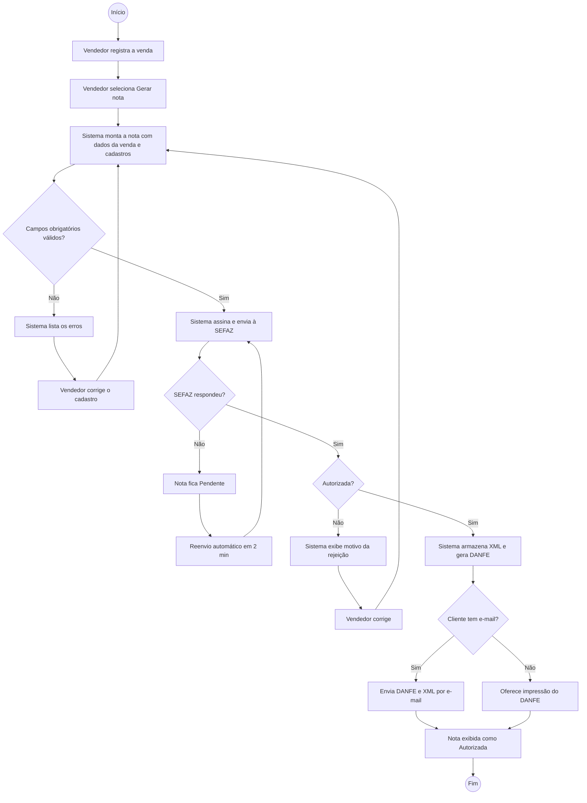

# Diagrama de Atividades: Emitir NF-e a partir da venda (UC01)

> Responsável: Abraão Gomes da Silva Araújo (issue #5)

```mermaid
flowchart TD
    I((Início)) --> A[Vendedor registra a venda]
    A --> B[Vendedor seleciona Gerar nota]
    B --> C[Sistema monta a nota com dados da venda e cadastros]
    C --> D{Campos obrigatórios válidos?}
    D -- Não --> D1[Sistema lista os erros]
    D1 --> D2[Vendedor corrige o cadastro]
    D2 --> C
    D -- Sim --> F[Sistema assina e envia à SEFAZ]
    F --> G{SEFAZ respondeu?}
    G -- Não --> G1[Nota fica Pendente]
    G1 --> G2[Reenvio automático em 2 min]
    G2 --> F
    G -- Sim --> H{Autorizada?}
    H -- Não --> H1[Sistema exibe motivo da rejeição]
    H1 --> H2[Vendedor corrige]
    H2 --> C
    H -- Sim --> J[Sistema armazena XML e gera DANFE]
    J --> K{Cliente tem e-mail?}
    K -- Sim --> L[Envia DANFE e XML por e-mail]
    K -- Não --> M[Oferece impressão do DANFE]
    L --> N[Nota exibida como Autorizada]
    M --> N
    N --> FIM((Fim))
```
